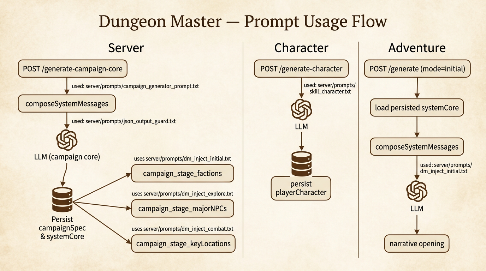

# Dungeon Master — Prompt Flow Overview

This repository powers Dungeon Master (a DM assistant). The diagram below shows how server-side prompts are loaded, rendered, injected, and used across campaign generation, background stages, character creation, and adventure (initial scene) generation.

Diagram (rendered image)




Notes
- The canonical prompt templates live in `server/prompts/`. Edit them with Mustache variables such as `{{campaignConcept}}`, `{{#factions}}...{{/factions}}`, or `{{languageInstruction}}`.
- Campaign generation is intentionally small and reliable; background stages expand the campaign and are persisted.
- Initial adventure generation injects DM-only rendered context from the persisted `campaignSpec` so adventures relate to the campaign background while starting naturally.

# Dungeon Master

Dungeon Master is a web-based application designed to deliver a tabletop role-playing game (TTRPG) experience, guided by an AI Dungeon Master. Players sign in with **Google**, games are **scoped to accounts** (with optional **invite links** for additional players in the same campaign). Utilizing cutting-edge AI language models such as GPT-3.5-turbo and GPT-4, this platform offers a seamless integration of an AI Dungeon Master with an AI notetaker to craft an immersive narrative for games like Dungeons & Dragons.

The project originated from Cole Porter (Deck of DM Things on YouTube) and was supported by a dedicated Patreon community. When the project grew beyond the scope manageable by Cole, the decision was made to open-source Dungeon Master and discontinue the Patreon.

## Table of Contents

- [Prerequisites](#prerequisites)
- [Setting up External Dependencies](#setting-up-external-dependencies)
- [Installation](#installation)
- [Testing (server)](#testing-server)
- [Usage](#usage)
- [Contributing](#contributing)
- [License](#license)
- [Credits](#credits)
- [Contact](#contact)

## Prerequisites

Required software and libraries are listed in the project’s `package.json` file found in the root directory.

## Setting up External Dependencies

### .env File

For proper functioning of the application, you must set up the following environment variables:

#### MongoDB Atlas

- **Purpose**: Storing game save data and user accounts.
- **Setup**:
  1. Sign up or log in to [MongoDB Atlas](https://www.mongodb.com/cloud/atlas).
  2. Create a new cluster and follow the setup guide.
  3. Retrieve your connection string by navigating to the 'Connect' section of your cluster.
  4. In your `.env` file, add `DM_MONGODB_URI=your_connection_string`.

#### OpenAI API

- **Purpose**: Interacting with AI models for generating and managing game content.
- **Setup**:
  1. Sign up for an account at [OpenAI](https://openai.com/).
  2. Generate an API key in the API section.
  3. In your `.env` file, add `DM_OPENAI_API_KEY=your_api_key`.

#### Google Sign-In and session JWT (required for play)

- **Purpose**: Identify users, restrict `/api/game-state/*` and `/api/game-session/*` to members of each game, and support invites.
- **Server** (`server/.env`; copy from [`server/env.example`](server/env.example)):
  - `DM_GOOGLE_CLIENT_ID` — Web application client ID from [Google Cloud Console](https://console.cloud.google.com/apis/credentials) (OAuth 2.0 Client IDs, type **Web**). Under that client, **Authorized JavaScript origins** must list the **exact** origin you use in the browser (scheme + host + port). Examples: `http://localhost:8080` and `http://127.0.0.1:8080` are **different** — add both if you switch. If this is wrong, the browser console shows `The given origin is not allowed for the given client ID` and requests to `accounts.google.com/gsi/button` return **403**.
  - `DM_JWT_SECRET` — Long random string used only to sign **app session JWTs** (e.g. `openssl rand -hex 32`). **Do not** reuse your Google OAuth **client secret** here.
- **Client** (`client/dungeonmaster/.env`; copy from [`client/dungeonmaster/env.example`](client/dungeonmaster/env.example)):
  - `VUE_APP_DM_GOOGLE_CLIENT_ID` — Same value as `DM_GOOGLE_CLIENT_ID` (the public Web client ID).

Optional: `DM_FRONTEND_URL`, `DM_CORS_ORIGINS`, and `DM_API_BASE` (client `main.js`) for non-default hosts (see env examples).

### Installation

1. Ensure that you have npm installed on your machine. If not, download and install [npm](https://www.npmjs.com/get-npm).
2. In the project's root directory, execute `npm install` to install dependencies.
   - If you encounter any issues, such as permissions errors, consult the npm troubleshooting guide (https://docs.npmjs.com/getting-started/troubleshooting)

### Testing (server)

From `server/`:

```bash
npm test
```

Runs `node:test` on `server/test/**/*.test.js`: unit tests for `gameAccess`, plus HTTP integration tests (`supertest` + in-memory MongoDB via `mongodb-memory-server`) covering `/api/game-state/mine`, `/load`, `/api/game-session/create-invite`, and `POST /api/auth/join`. The first run may download a MongoDB binary for the memory server.

### Usage

To start Dungeon Master:

1. Open a terminal and navigate to the project's root directory.
2. Run `npm start` to launch both frontend and backend servers.
3. Open your web browser and enter the local URL provided by the output in the terminal.

You will be greeted with the Dungeon Master home page. Sign in with Google (after configuring OAuth origins), set a **player name** the first time, then use **New game** or **Load game** to play.

## Contributing

Your contributions are welcome! Whether it's bug reporting, code improvement, feature proposal, or project maintenance, your help is invaluable.

### Development Process

We embrace [Github Flow](https://guides.github.com/introduction/flow/index.html). All changes are made through pull requests.

### Making Contributions

To contribute, follow these steps:

1. Fork the repository and create your branch from `main`.
2. Write clear, commented, and testable code.
3. Update documentation to reflect any changes.
4. Ensure your code adheres to the coding style guide.
5. Submit a pull request with a comprehensive description of changes.

### License

Contributions are licensed under the [MIT License](LICENSE). Ensure you understand the license implications before contributing.

### Reporting Bugs

Report bugs and issues on the Discrord: https://discord.gg/GdsmyUX69N

**Effective bug reports should include:**

- A summary and background
- Reproduction steps with specific examples
- The expected outcome
- What actually occurred
- Additional notes or hypotheses

### Coding Style

- Use 4 spaces for indentation.
- Run `npm run lint` before committing to ensure consistent code style.

## License

This project is made available under the [MIT License](LICENSE).

## Credits

Special thanks to our Patreon supporters who helped kickstart this project. (Full list of supporters at the document's end)

Parts of this project were developed with assistance from GPT-4 by OpenAI.

## Contact

Email: deckofdmthings@gmail.com

## Original Patreon Supporters

Original Patreon supporters:
lalilunanu
Jonny Martinez
Michelle Hedden
Aaron Aldaco
MadWhim
Lerust
Rodrigo Raya
WhiteBulL
Viktor Grén
Matthew W Rodgers
Jim Harten
Mephisto Strange
Foundry Fabrications
Julius Lahdenoja
Humble Arrogance
Greg Germano
Ethan Babauta
Panzrom 
Chad Bastian
Benjamin Catt
Julienlemab Roblox
Aviox
Snowdric
bill mother
LetterQ
Matthew Akin
czechpls 
Monsi7
Jay Kudo
Shift_
yuri 2
Randy Prather
Midnight Black Wolf
AWS
Mahn Jones
Jonatan 
K
Jason Findley
Chase
Jason
Keegan 
Dragonistic
DarnChaCha 
Gab
Ash
Syquan Perrett
Jakub Čech
Jake 
Austin Caudill
Vincent Chalnot
Lasse
ArcaneOverride
Jason Apgar
Dave Hunt
Eli Blake
Timothy Castillo
saphix gaming
Geoffrey Ashe
Gecepe Tango Mango
Allen Hueffmeier
Dizzel
BrotherHanan
Julien Kovacs
theeddy 329
Beefy Beef
Tucker Radgens
Scientist Tomzi White Cloud
Bgjjj Gggh
Matt Lewis
Chris Turnbull
Sven
Nicholas Shappell
Zac
Evelien
JohnJ
Stig 
DominoTwo
Addie
Rickard Nilsson
Grekqo
Presten Stewart
Mason J.
Michael King
Marius Rognstad
David Williams
DeFour
Brandon Mabry
Levi Carpman
FletcherCutting
Remi Løvik
Vlad Dumitru
Astyria
Brandon Laszynskyj
Mark Shuttleworth
KLM
Ironspider 1
James Lyons
Jonathan LANIER
Andrew Hamilton
Edy
Josh Phillips
Maks
Andrew Wagner
Jeremy Seaton
Garrett
Dan Smith
Joshua McVay
Lars Hoffmann
Gael Lendoiro
Pedro_26
mikel sleep
Robert Davidsson
Julien Gaillard
Rubychoco
Avery Goodname
J N
Revolve02
Samuel Hargraves
Knism

